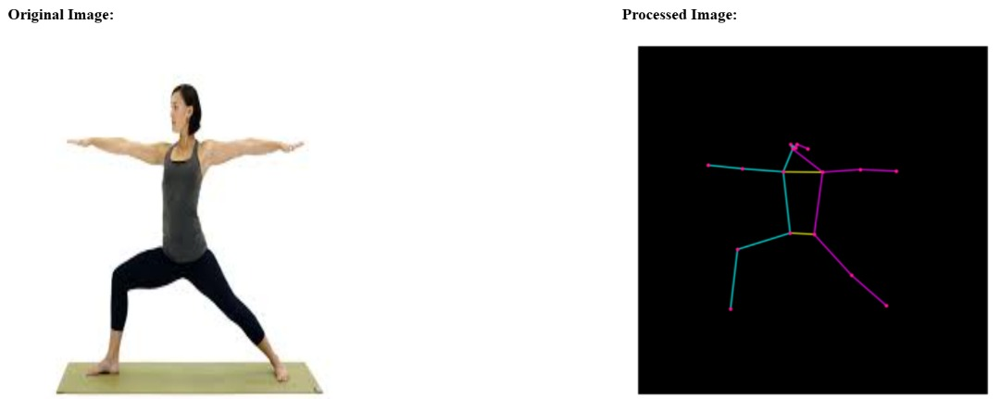

# Body Pose Estimation

This project implements a body pose estimation system using TensorFlow. It's designed to detect human figures in images and predict their pose.

## Project Description


The body pose estimation system uses a pre-trained TensorFlow model to analyze images and identify human body joints, allowing for pose estimation in various settings. This application is useful for motion analysis, augmented reality, and other applications where understanding body position is crucial.

## Features

- Pose estimation with high accuracy.
- Support for various image formats.
- Easy-to-use web interface for uploading images.
- Download the key points on black canvas

## Installation

To set up the project, follow these instructions:

1. **Clone the repository:**
   ```bash
   git clone https://github.com/yinde0/body-pose.git
   cd body-pose
   ```
2. **Set up a Python virtual environment (optional but recommended):**
    ```bash
    python -m venv venv
    source venv/bin/activate  # On Windows use `venv\Scripts\activate`
    ```
3. **Install required packages:**
    ```bash
    pip install Flask
    pip install -q imageio
    pip install -q opencv-python
    pip install -q git+https://github.com/tensorflow/docs
    pip install -r requirements.txt
    ```
4. **Run the application:**
    ```bash
    python main.py
    ```

## Usage
To use the application, navigate to http://localhost:5000 in your web browser, upload an image, and the system will display the estimated pose.

